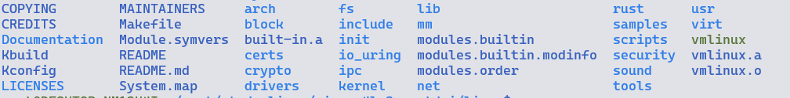

## 作业1

进入Linux文件夹，使用如下命令进行编译：

```bash
make x86_64_defconfig
make LLVM=1 menuconfig
#set the following config to yes
General setup
        ---> [*] Rust support
make LLVM=1 -j$(nproc)
```

在最后你将在Linux文件夹下，得到一个vmlinux的文件，那么就算成功了


