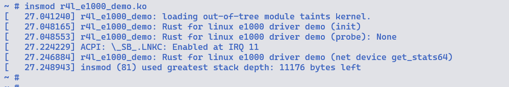
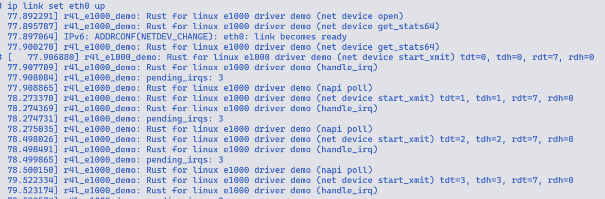
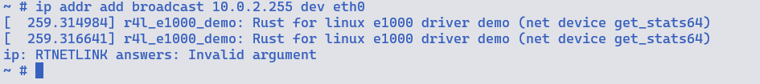
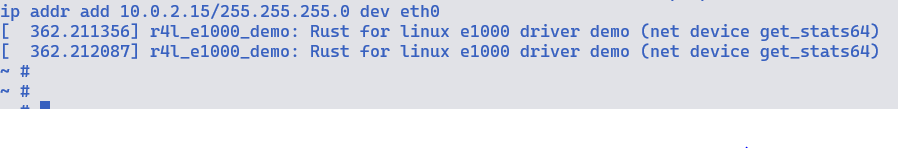
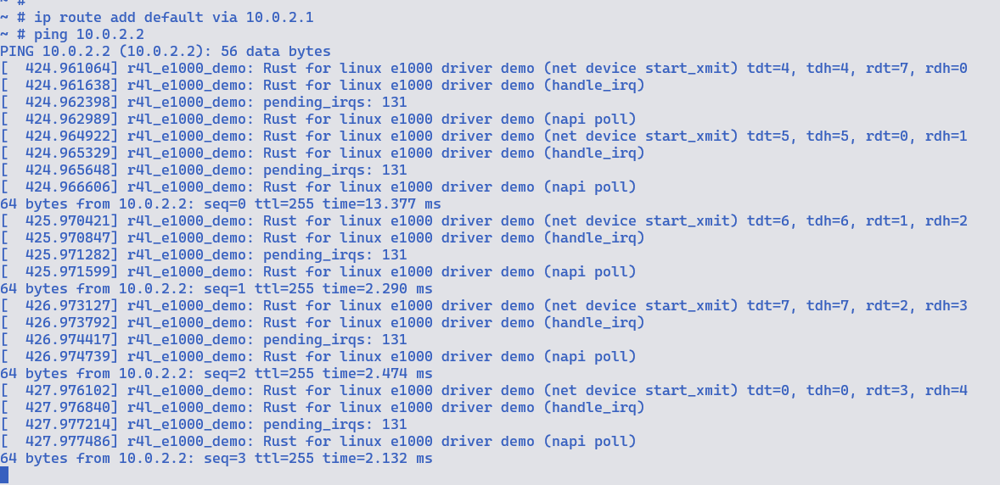

## 作业2
Q: 在该文件夹中调用make LLVM=1，该文件夹内的代码将编译成一个内核模块。请结合你学到的知识，回答以下两个问题：

1、编译成内核模块，是在哪个文件中以哪条语句定义的？

2、该模块位于独立的文件夹内，却能编译成Linux内核模块，这叫做out-of-tree module，请分析它是如何与内核代码产生联系的？

A: 
1. 使用 src_e1000/Kbuild 中的

```
obj-m := r4l_e1000_demo.o
```

2. 根据`Makefile`中的`KDIR`找到`linux`目录路径, 找到`.config`文件, 

## 记录步骤和截图

1. 首先在`cicv-r4l-3-xxx`的`busybox-1.36.1`目录中, 执行命令

```shell
make menuconfig

# 在Settings项中, 选择 Build static binary (no shared libs)

Settings
    ---> [*] Build static binary (no shared libs)

```

2. 进入`linux`目录, 执行命令

```shell
make x86_64_defconfig

make LLVM=1 menuconfig

General setup
    ---> [*] Rust support

# 编译
make LLVM=1 -j$(nproc)
```

3. 进入`src_e1000`执行脚本

```shell
./build_image.sh
```

这个脚本会将`busybox-1.36.1/_install/`下所有的文件拷贝到`src_e1000/rootfs/`,
所以在之前要对`busybox-1.36.1`里面的文件进行编译

```shell
# 进入源代码目录
cd busybox-1.36.1

# 启动menuconfig进行配置
make menuconfig

# 在Settings项中，将"Build static binary (no shared libs)"选中
Settings
          ---> [*] Build static binary (no shared libs)
# 退出

```









