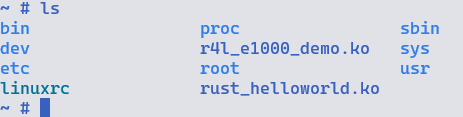
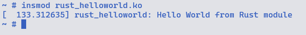

## 作业3

1. 在`linux/samples/rust/`目录中添加`rust_helloworld.rs`, 并添加内容

```rust
// SPDX-License-Identifier: GPL-2.0
//! Rust minimal sample.
      
use kernel::prelude::*;
      
module! {
  type: RustHelloWorld,
  name: "rust_helloworld",
  author: "whocare",
  description: "hello world module in rust",
  license: "GPL",
}
      
struct RustHelloWorld {}
      
impl kernel::Module for RustHelloWorld {
  fn init(_name: &'static CStr, _module: &'static ThisModule) -> Result<Self> {
      pr_info!("Hello World from Rust module");
      Ok(RustHelloWorld {})
  }
}

```

2. 在`linux/samples/rust/Kconfig`文件中添加

```
config HELLO_WORLD
	tristate "Hello world"
	help
	  Print Helloworld in Rust.

	  If unsure, say N.
```

3. 在`linux/samples/rust/Makefile`中添加

```
obj-$(CONFIG_HELLO_WORLD)               += rust_helloworld.o
```

4. 在`linux`目录下执行

```shell
make LLVM=1 menuconfig
```

修改模块配置

```
Kernel hacking
  ---> Sample Kernel code
      ---> Rust samples
        ---> <M> Hello world
```

编译模块

```shell
make LLVM=1 -j$(nproc)
```

5. 将`linux/samples/rust/rust_helloworld.ko`复制至`src_e1000/rootfs/`中

```shell
cp linux/samples/rust/rust_helloworld.ko src_e1000/rootfs/
```

6. 进入`src_e1000`目录中执行`build_image.sh`

```shell
cd src_e1000

./build_image.sh
```



