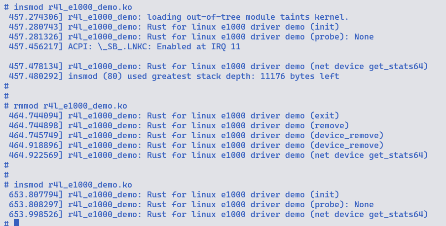

## 作业4

1. 禁用`e1000`的网卡驱动

```shell
make LLVM=1 menuconfig

---> Device Drivers 
  ---> Network device support
    ---> Ethernet driver support
      ---> Intel devices
         ---> <> Intel(R) PRO/1000 Gigabit Ethernet support # 按N取消


```

2. 按照`e1000_main.c`中`e1000_remove`函数修改`r4l_e1000_demo.rs`

```rust
// impl pci::Driver for E1000Drv

    // 由于缺少e1000_remove中
    // pci_release_selected_regions 和
    // pci_disable_device必要的参数类型
    // 所以后续需要
    fn remove(dev: &mut pci::Device, data: &Self::Data) {
        pr_info!("Rust for linux e1000 driver demo (remove)\n");

        let bars = data.bars;
        DeviceRemoval::device_remove(data);
        dev.release_selected_regions(bars);
        dev.disable_device();
    }

// impl driver::DeviceRemoval for E1000DrvPrvData

    fn device_remove(&self) {
        pr_info!("Rust for linux e1000 driver demo (device_remove)\n");

        let device = self._netdev_reg.dev_get();
        device.netif_stop_queue();
        device.netif_carrier_on();
    }
```

3. 修改`linux/rust/kernel/pci.rs`

```rust
    extern "C" fn remove_callback(pdev: *mut bindings::pci_dev) {
        // SAFETY: `pdev` is guaranteed to be a valid, non-null pointer.
        let ptr = unsafe { bindings::pci_get_drvdata(pdev) };
        // SAFETY:
        //   - we allocated this pointer using `T::Data::into_pointer`,
        //     so it is safe to turn back into a `T::Data`.
        //   - the allocation happened in `probe`, no-one freed the memory,
        //     `remove` is the canonical kernel location to free driver data. so OK
        //     to convert the pointer back to a Rust structure here.
        let data = unsafe { T::Data::from_pointer(ptr) };
        let mut dev = unsafe { Device::from_ptr(pdev) };
        T::remove(&mut dev, &data);
        <T::Data as driver::DeviceRemoval>::device_remove(&data);
    }
```

4. 编译执行

```
make LLVM=1 -j$(nproc)
```



