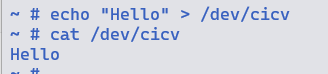

## 作业5

1. 修改`linux/samples/rust/rust`

```rust
    fn write(this: &Self,_file: &file::File,reader: &mut impl kernel::io_buffer::IoBufferReader,_offset:u64) -> Result<usize> {
        let buff_size = reader.len().min(GLOBALMEM_SIZE);
        {
            let mut inner = this.inner.lock();
            reader.read_slice(&mut inner[..buff_size])?;            
        }

        Ok(buff_size)
    }

    fn read(this: &Self,_file: &file::File,writer: &mut impl kernel::io_buffer::IoBufferWriter,offset:u64) -> Result<usize> {
        if writer.is_empty() {
            return Ok(0);
        }

        let offset = offset as usize;
        let buff_size = writer.len().min(GLOBALMEM_SIZE - offset);

        {
            let inner = this.inner.lock();
            writer.write_slice(&inner[offset..offset + buff_size])?
        }

        Ok(buff_size)
    }

```



Q：作业5中的字符设备/dev/cicv是怎么创建的？


在`src_e1000\build_image.sh`中

```shell
echo "mknod /dev/cicv c 248 0" >> etc/init.d/rcS
```

Q: 它的设备号是多少？

248

Q: 它是如何与我们写的字符设备驱动关联上的？

通过`module`注册绑定